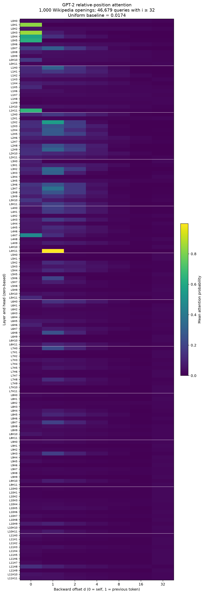
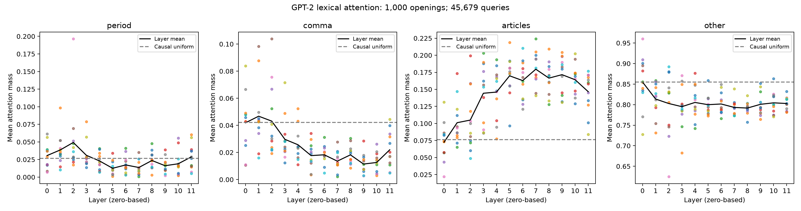
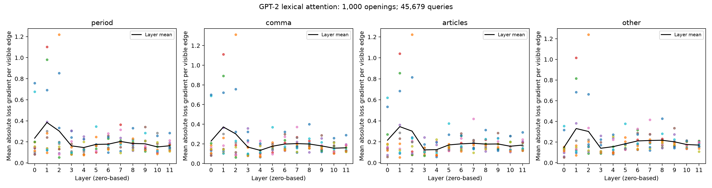
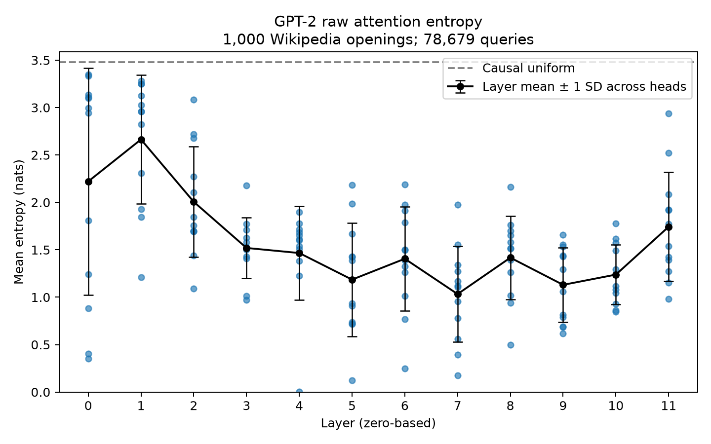
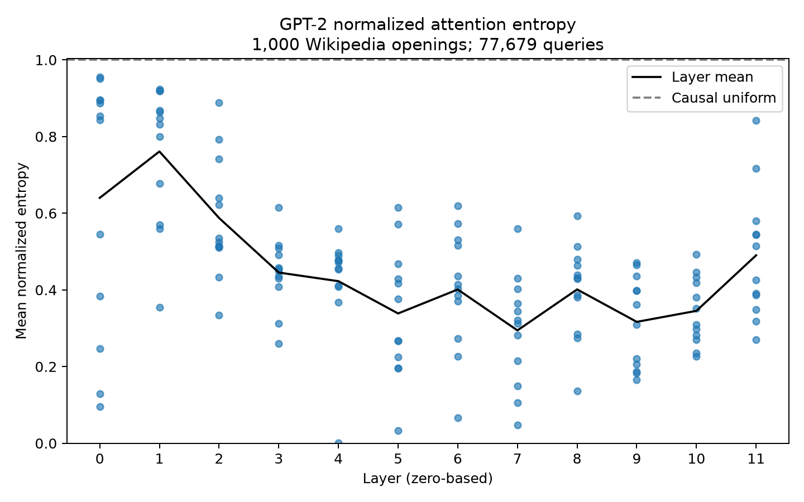
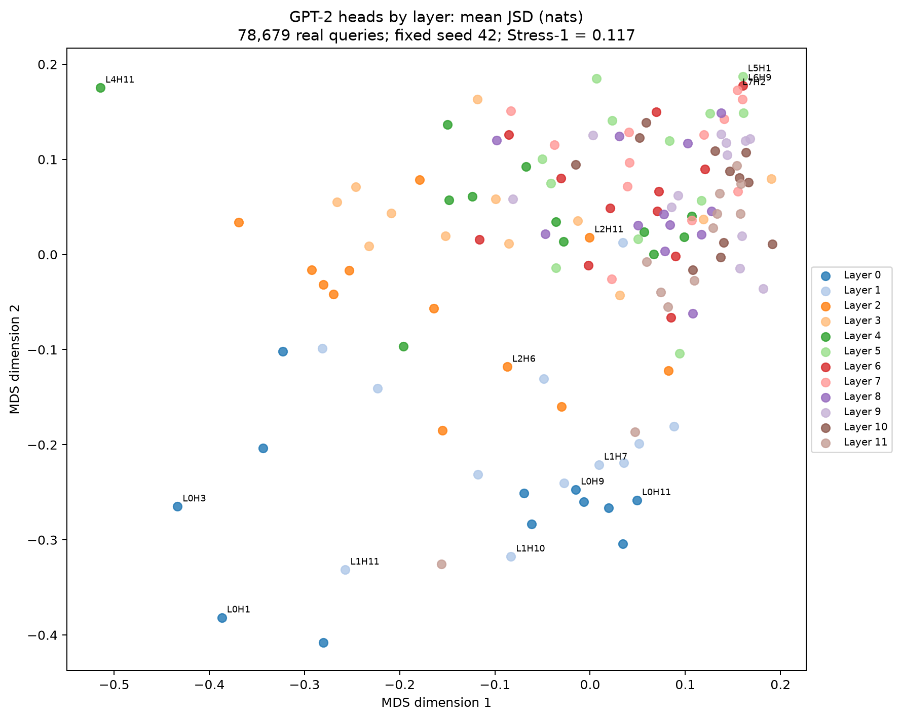
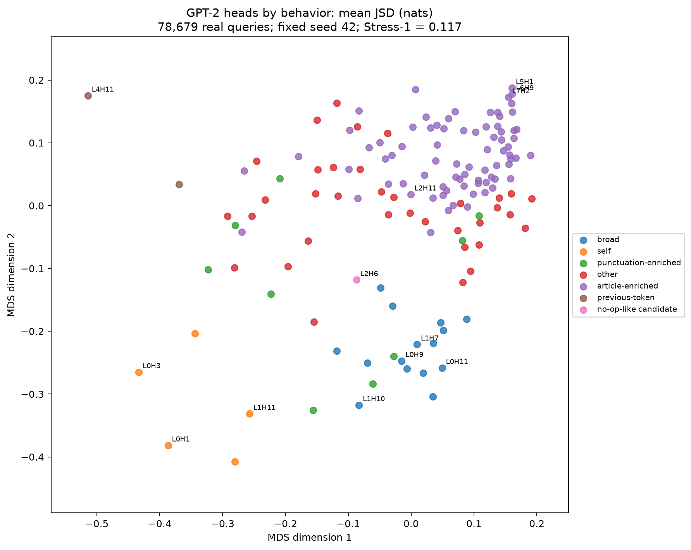

# What Does GPT-2 Look At? An Analysis of Attention in a Causal Language Model

**Chao-Yang Tung and Cheng-Fu Tu**

## Abstract

Clark et al. (2019) identified recurring behaviors among BERT's attention heads. Some heads attend to fixed relative positions, and some send most of their attention to `[SEP]` as a no-op. Heads also range from focused to broad, and heads in the same layer behave similarly. We test whether these behaviors appear in GPT-2 Small, a causal language model. Using 1,000 Wikipedia passages, we measure positional preferences, attention to and gradient sensitivity of candidate no-op tokens, attention entropy, and Jensen–Shannon divergence between heads. GPT-2 has a near-deterministic previous-token head, strongly self-attending heads in the first layer, broad heads concentrated in early layers, and a moderate tendency for heads in the same layer to behave alike. One head attends heavily to periods while its loss is insensitive to those weights, a limited analogue of BERT's no-op behavior. Causal masking explains the absence of next-token heads and the position-dependent entropy ceiling, but not the remaining differences.

## 1 Introduction

Pretrained Transformer language models (Vaswani et al., 2017) such as BERT (Devlin et al., 2019) and GPT-2 (Radford et al., 2019) learn general-purpose representations through self-supervised prediction. Their downstream success suggests they acquire substantial linguistic knowledge, but performance alone does not show what the models represent or how they compute.

Prior work has studied this question in three main ways. The first examines model **outputs** on carefully constructed inputs, for example subject–verb agreement across intervening material (Linzen et al., 2016; Goldberg, 2019). The second uses **probing classifiers**, which test whether properties such as part of speech or syntactic distance can be recovered from hidden representations (Conneau et al., 2018; Tenney et al., 2019; Hewitt and Manning, 2019). The third studies **attention maps**, which give an explicit distribution over input tokens for each head. Researchers have analyzed attention in machine translation models (Raganato and Tiedemann, 2018; Voita et al., 2019), GPT-2 (Vig and Belinkov, 2019), and BERT (Kovaleva et al., 2019). Whether attention weights explain predictions remains debated (Jain and Wallace, 2019; Serrano and Smith, 2019; Wiegreffe and Pinter, 2019).

Clark et al. (2019) systematically analyzed BERT's attention. Many heads attend to fixed relative positions, and attention concentrates heavily on the special tokens `[SEP]` and `[CLS]`. Gradient analysis suggested that `[SEP]` serves as a no-op destination for heads whose function does not apply. Heads range from very focused to very broad, and heads in the same layer tend to behave similarly.

We ask **which of these behaviors appear in GPT-2 Small, and which differences follow from its causal architecture.** Under causal attention each token sees only its prefix. This rules out attention to the next token and changes the support of every attention distribution. GPT-2 also has no separator tokens; its `<|endoftext|>` token normally appears only at the end of a document. We therefore test whether frequent, low-content tokens, namely punctuation and articles, serve as no-op destinations instead.

## 2 Experimental Setup

We analyze GPT-2 Small (124M parameters; 12 layers × 12 heads). Let $A^{(h)}_{x,i,j}$ denote the post-softmax attention of head $h$ from query position $i$ to key position $j\leq i$ in passage $x$. We write heads as L*l*H*k* with zero-based indices; for example, L4H11 is layer 4, head 11.

The corpus consists of 1,000 opening paragraphs of randomly sampled English Wikipedia articles. Each paragraph contains at least 33 tokens and is truncated to 128 tokens, matching the segment length of Clark et al. No special tokens are inserted. The corpus contains 78,679 tokens.

Attention maps from different passages are not aligned, so we compute per-query statistics that are comparable across passages. These statistics are relative offset, key-token class, entropy, and divergence between heads on the same query. We then average them with equal weight per query token. The positional and lexical analyses use queries at positions $i\geq32$, so that all tested offsets exist. The entropy and similarity analyses use all tokens.

## 3 Surface-Level Patterns

### 3.1 Relative position

For each backward offset $d\in\{0,1,2,4,8,16,32\}$ we measure the mean attention to that position,

$$
R_h(d)=\operatorname{mean}_{x,\,i\geq32} A^{(h)}_{x,i,i-d}.
$$

Uniform attention over the prefix would assign 1.74% to each position on average.

_Figure 1. Mean attention at each backward offset for all 144 heads. Offset 0 is the current token._

Five heads assign more than half of their attention to the current token: L0H1, L0H3, L0H4, L0H5, and L1H11. The strongest is **L0H3** at 84.91%. Two heads assign more than half to the previous token: **L2H2** (55.41%) and **L4H11** (99.86%). No head assigns more than 25% to any longer offset.

Previous-token heads match the BERT findings. Strong self-attention is more prominent than in BERT, where Clark et al. report that most heads put little attention on the current token. BERT's next-token heads have no counterpart in GPT-2, because causal masking sets attention to all future positions to zero.

### 3.2 Lexical no-op destinations

Clark et al. argue that `[SEP]` acts as a no-op based on two observations: it receives high attention, and the loss gradient with respect to that attention is small. We apply the same test to three token classes: periods, commas, and the articles _the_, _a_, and _an_. All remaining tokens form the comparison class, _other_.

For class $C$, we compute the attention mass $M_C$ and the mass $U_C$ expected under uniform attention:

$$
M_C(i,h)=\sum_{j\leq i:\,x_j\in C} A^{(h)}_{x,i,j},
\qquad
U_C(i)=\frac{\#\{j\leq i:x_j\in C\}}{i+1}.
$$

Enrichment $E_C(h)=\mathbb{E}[M_C]/\mathbb{E}[U_C]$ controls for class frequency. For gradient importance, we replace BERT's masked-LM loss with GPT-2's next-token cross-entropy $L$. We then average $|\partial L/\partial A^{(h)}_{x,i,j}|$ over attention edges whose key belongs to each class, and report the result relative to _other_ within the same head.

_Figure 2. Mean attention to each token class. Points are heads; lines are layer means._

_Figure 3. Mean gradient magnitude of the loss with respect to attention, by key-token class._

| Class    | Most enriched head | Attention | Uniform | Enrichment | Gradient / other |
| -------- | ------------------ | --------: | ------: | ---------: | ---------------: |
| Period   | L2H6               |    19.63% |   2.65% |      7.41× |            0.241 |
| Comma    | L2H5               |    10.38% |   4.22% |      2.46× |            0.717 |
| Articles | L7H2               |    22.40% |   7.62% |      2.94× |            0.953 |

**L2H6 shows the clearest no-op-like behavior.** Its attention to periods is 7.4 times the uniform rate, while the gradient on those edges is about a quarter of the gradient on ordinary tokens. This is the same pattern Clark et al. found for `[SEP]`. The other classes provide weaker evidence. In L1H5, commas are enriched (2.33×) but receive _larger_ gradients than ordinary tokens (1.18×). In the five most article-enriched heads, gradients drop only modestly (0.84–0.95×). GPT-2 therefore shows an isolated analogue of BERT's no-op behavior, not the widespread middle-layer pattern Clark et al. observed.

**Periods are the closest lexical counterpart to `[SEP]`.** In BERT, `[SEP]` closes every segment, so it marks a boundary and carries little content of its own. GPT-2 has no separator token, but periods play a similar role in ordinary text: they end nearly every sentence and add little meaning beyond the boundary. Under causal attention, the periods that end earlier sentences also stay visible to every later token, whereas a document-final `<|endoftext|>` does not. Commas and articles are also frequent, but they occur inside sentences and depend on the words around them, so attention to them may still carry information. This may explain why the no-op-like pattern appears for periods but not for the other classes.

### 3.3 Focused and broad attention

We compute the entropy of each attention distribution,

$$
H_{x,i,h}=-\sum_{j=0}^{i}A^{(h)}_{x,i,j}\log A^{(h)}_{x,i,j}.
$$

Under causal attention, entropy is bounded by $\log(i+1)$, which grows with position. Alongside raw entropy, we therefore report normalized entropy $H/\log(i+1)$, which equals 1 for uniform attention.

_Figure 4. Mean raw entropy of each head by layer. Black points are layer means; error bars show ±1 SD across the 12 heads in each layer._

_Figure 5. Mean entropy normalized by $\log(i+1)$. Error bars as in Figure 4._

| Head  | Normalized entropy | Behavior in §3.1–3.2                         |
| ----- | -----------------: | -------------------------------------------- |
| L4H11 |              0.002 | Previous-token attention of 99.86%           |
| L5H1  |              0.033 | Article enrichment of 2.87×                  |
| L7H2  |              0.047 | Article enrichment of 2.94×                  |
| L6H9  |              0.066 | Article enrichment of 2.76×                  |
| L0H1  |              0.095 | Self-attention of 83.02%                     |
| L0H11 |              0.956 | Near-uniform at all tested offsets           |
| L0H9  |              0.951 | Broad, with a mild previous-token preference |

The five broadest heads all lie in layers 0–1, consistent with the broad lower-layer heads Clark et al. found in BERT. Mean normalized entropy is highest in layer 1 (0.761) and lowest in layer 7 (0.294), and it rises again in layer 11 (0.490). Raw entropy shows the same trends.

The most focused heads specialize in different ways. L4H11 is focused because it attends to a fixed offset. L5H1, L7H2, and L6H9 are equally focused, but no tested offset dominates, and articles receive only 21–22% of their attention. Conversely, the no-op candidate L2H6 has moderate normalized entropy (0.66). A head can therefore prefer a token class without concentrating its attention.

## 4 Clustering Attention Heads

Following Clark et al., we define the distance between two heads as the mean Jensen–Shannon divergence between their attention distributions on the same query token:

$$
D(h_a,h_b)=\mathbb{E}_{x,i}\!\left[\operatorname{JS}\!\left(A^{(h_a)}_{x,i,:},A^{(h_b)}_{x,i,:}\right)\right],
\qquad
\operatorname{JS}(P,Q)=\tfrac12\operatorname{KL}(P\|M)+\tfrac12\operatorname{KL}(Q\|M),
\quad M=\tfrac{P+Q}{2}.
$$

We embed the 144 × 144 distance matrix in two dimensions with metric multidimensional scaling (MDS), using SMACOF with eight random initializations and keeping the lowest-stress solution. We use metric rather than classical MDS because JSD is not a Euclidean distance. The correlation between embedded and original distances is 0.98, so the embedding preserves the overall structure. Stress-1, the relative error in the embedded distances, is 0.12, which is only fair by Kruskal's guideline (0.1 fair, 0.2 poor; Kruskal, 1964). We therefore interpret broad regions of the embedding but not small distances between individual heads; distances in §4 are computed from the original divergences.

_Figure 6. MDS embedding of all 144 heads, colored by layer._

_Figure 7. The same embedding, colored by the behavioral categories of Section 3._

**Layer structure.** Heads in the same layer have lower mean divergence (0.177) than heads in different layers (0.254). For 21% of heads, the nearest neighbor is in the same layer, compared with 8% expected by chance. As in BERT, heads within a layer tend to behave alike, although layers do not separate cleanly.

**Behavioral structure.** We assign heads to descriptive groups. Positional groups require at least 50% attention at the target offset. Broad heads have normalized entropy of at least 0.8, and focused heads at most 0.1. Lexical groups require enrichment of at least 2×.

| Behavioral group     | Heads | Within-group JSD | Group-to-other JSD |
| -------------------- | ----: | ---------------: | -----------------: |
| Self-attending       |     5 |            0.136 |              0.511 |
| Previous-token       |     2 |            0.199 |              0.491 |
| Broad                |    16 |            0.108 |              0.325 |
| Focused              |     5 |            0.476 |              0.383 |
| Article-enriched     |    77 |            0.139 |              0.295 |
| Punctuation-enriched |    11 |            0.248 |              0.303 |

Self-attending, previous-token, and broad heads each form compact regions, as Clark et al. found for BERT's positional and broad heads. Focused heads do not: two heads can be equally concentrated while attending to different tokens. The exception is **L5H1 and L7H2, the closest pair of heads overall** (0.016), both of which are also close to L6H9. These three heads lie in different layers yet produce nearly identical attention distributions, so they likely implement a shared pattern. L2H6 is the only head that combines at least 2× enrichment with a gradient ratio of at most 0.5, so we cannot test whether no-op-like heads cluster.

## 5 Discussion and Conclusion

**Findings that transfer from BERT.** GPT-2 Small shares several organizational patterns with BERT. It has previous-token heads, broad heads in early layers, and greater similarity among heads in the same layer. These correspondences are qualitative, because we compare against published BERT results rather than rerunning BERT under identical conditions.

**Findings that differ.** GPT-2 has no next-token heads and no widespread counterpart to BERT's `[SEP]` attention; only one head shows clear no-op-like behavior. GPT-2 also has strongly self-attending heads in its first layer, which Clark et al. report as uncommon in BERT.

**The role of causal attention.** The causal mask fully explains the absence of next-token heads. It also explains why broad heads average only over the prefix, why the maximum entropy grows with position, and why a document-final `<|endoftext|>` cannot act as a separator for earlier tokens. It does not explain the strong self-attention, the specific lexical preferences, or the non-monotonic depth profile of entropy. These differences may instead reflect the training objective, tokenization, training data, or BERT's special-token input format. Separating these factors would require models that differ only in attention direction.

**Conclusions.** (1) Several qualitative findings about BERT carry over to a causal language model: positional heads, broad early-layer heads, and within-layer similarity. (2) Where a head attends, how concentrated its attention is, and how sensitive the loss is to it are distinct properties: focused heads need not share targets, and a lexical preference need not indicate a no-op. (3) L2H6's attention to periods is the clearest no-op-like behavior in GPT-2, but it is isolated. (4) Causal masking explains the missing next-token heads and the position-dependent entropy ceiling, but not the remaining learned differences.

## 6 Limitations

**Data.** Our corpus contains only short Wikipedia opening paragraphs of 33 to 128 tokens. Behavior may differ for other genres, later paragraphs, or longer contexts, and short windows give little evidence about long-range dependencies.

**Model.** We study a single GPT-2 Small checkpoint. Our comparison with BERT relies on published results, which are confounded by differences in input format, tokenization, objective, and training data.

**Averaging and definitions.** Equal weighting of query tokens gives longer passages more influence, and averages can hide passage-specific behavior. The positional and lexical analyses use only positions $i\geq32$. Our token classes include only single-token words and punctuation. The uniform baseline does not control for syntactic or positional regularities.

**Uncertainty.** All estimates are descriptive, without confidence intervals or correction for selecting extreme heads. Behavioral thresholds are heuristic, and MDS distorts some pairwise distances.

**Causality.** Attention weights show how value vectors are combined, not what those vectors contain or how they affect the prediction. Gradients measure only local sensitivity; they do not show the effect of actually redistributing attention. Establishing causal roles would require head ablation (Michel et al., 2019) or attention interventions.

## Partner Contributions

**Chao-Yang Tung** wrote the codebase used for the final results and ran all four experiments. He adapted the initial plan, replacing `<|endoftext|>` with periods, commas, and articles as candidate no-op tokens and adding the gradient-based test of no-op behavior (§3.2). He also wrote the first draft of this report, including the analysis and conclusions in each section.

**Cheng-Fu Tu** designed the initial experimental plan and wrote a first implementation of all four analyses, including a test that the attention weights match Hugging Face. Cheng-Fu Tu discussed the design with Chao-Yang Tung throughout and revised this report, for example, explaining why periods resemble `[SEP]` (§3.2), describing the MDS method and its fit (§4).

## References

Clark, K., Khandelwal, U., Levy, O., and Manning, C. D. (2019). What does BERT look at? An analysis of BERT's attention. _Proceedings of the 2019 ACL Workshop BlackboxNLP_, 276–286.

Conneau, A., Kruszewski, G., Lample, G., Barrault, L., and Baroni, M. (2018). What you can cram into a single $&!#\* vector: Probing sentence embeddings for linguistic properties. _ACL_.

Devlin, J., Chang, M.-W., Lee, K., and Toutanova, K. (2019). BERT: Pre-training of deep bidirectional Transformers for language understanding. _NAACL_.

Goldberg, Y. (2019). Assessing BERT's syntactic abilities. _arXiv:1901.05287_.

Hewitt, J., and Manning, C. D. (2019). A structural probe for finding syntax in word representations. _NAACL_.

Jain, S., and Wallace, B. C. (2019). Attention is not explanation. _NAACL_.

Kovaleva, O., Romanov, A., Rogers, A., and Rumshisky, A. (2019). Revealing the dark secrets of BERT. _EMNLP_.

Kruskal, J. B. (1964). Multidimensional scaling by optimizing goodness of fit to a nonmetric hypothesis. _Psychometrika_, 29(1), 1–27.

Linzen, T., Dupoux, E., and Goldberg, Y. (2016). Assessing the ability of LSTMs to learn syntax-sensitive dependencies. _TACL_, 4.

Michel, P., Levy, O., and Neubig, G. (2019). Are sixteen heads really better than one? _NeurIPS_.

Radford, A., Wu, J., Child, R., Luan, D., Amodei, D., and Sutskever, I. (2019). Language models are unsupervised multitask learners. _OpenAI technical report_.

Raganato, A., and Tiedemann, J. (2018). An analysis of encoder representations in Transformer-based machine translation. _BlackboxNLP_.

Serrano, S., and Smith, N. A. (2019). Is attention interpretable? _ACL_.

Tenney, I., Xia, P., Chen, B., Wang, A., Poliak, A., McCoy, R. T., Kim, N., Van Durme, B., Bowman, S. R., Das, D., and Pavlick, E. (2019). What do you learn from context? Probing for sentence structure in contextualized word representations. _ICLR_.

Vaswani, A., Shazeer, N., Parmar, N., Uszkoreit, J., Jones, L., Gomez, A. N., Kaiser, Ł., and Polosukhin, I. (2017). Attention is all you need. _NeurIPS_.

Vig, J., and Belinkov, Y. (2019). Analyzing the structure of attention in a Transformer language model. _BlackboxNLP_.

Voita, E., Talbot, D., Moiseev, F., Sennrich, R., and Titov, I. (2019). Analyzing multi-head self-attention: Specialized heads do the heavy lifting, the rest can be pruned. _ACL_.

Wiegreffe, S., and Pinter, Y. (2019). Attention is not not explanation. _EMNLP_.

## Appendix: Reproduction

Run in order on a GPU node: `prepare_inspect.sbatch`, `experiment1.sbatch` (§3.1), `experiment2.sbatch` (§3.2), `experiment3.sbatch` (§3.3), `experiment4.sbatch` (§4). Results are written to `results/` and figures to `figures/`.
